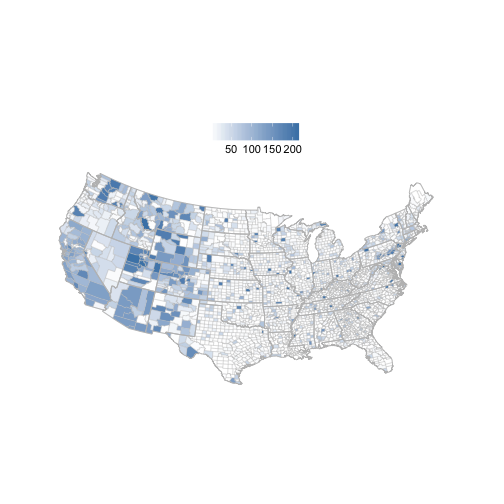

rbison
======


[](https://travis-ci.org/ropensci/rbison)
[](https://ci.appveyor.com/project/sckott/rbison)
[](https://codecov.io/github/ropensci/rbison?branch=master)
[](https://github.com/metacran/cranlogs.app)
[](https://cran.r-project.org/package=rbison)

Wrapper for the USGS Bison API.

## Info

See <https://bison.usgs.gov/#api> for API docs for the BISON API.


## Installation

From CRAN


```r
install.packages("rbison")
```

Or the development version from Github


```r
install.packages("devtools")
devtools::install_github("ropensci/rbison")
library('rbison')
```

Load package


```r
library("rbison")
```

Notice that the function `bisonmap` automagically selects the map extent to plot for you, being one of the contiguous lower 48 states, or the lower 48 plus AK and HI, or a global map. If some or all points outside the US, a global map is drawn, and throws a warning. . You may want to make sure the occurrence lat/long coordinates are correct.

## get data


```r
out <- bison(species = "Phocoenoides dalli dalli", count = 10)
```


### inspect summary


```r
out$summary
#>   total specimen
#> 1     7        7
```

### map occurrences


```r
bisonmap(out)
```


## All points within the US (including AK and HI)

### get data


```r
out <- bison(species = "Bison bison", count = 600)
```


### inspect summary


```r
out$summary
#>   total observation fossil specimen unknown centroid
#> 1  1217         252    162      796       7        1
```

### map occurrences


```r
bisonmap(out)
```


##  All points within the contiguous 48 states

### get data


```r
out <- bison(species = "Aquila chrysaetos", count = 600)
```


### inspect summary


```r
out$summary
#>   total observation fossil specimen literature unknown centroid
#> 1 91482       80582    118      785        556    9441        1
```


### map occurrences


```r
bisonmap(out)
```


## Map county or state level data

### Counties - using last data call for Aquila


```r
bisonmap(out, tomap = "county")
```



### States - using last data call for Aquila


```r
bisonmap(out, tomap = "state")
```


## BISON SOLR interface

### taxa

The taxa service searches for and gives back taxonomic names


```r
bison_tax(query = "*bear")
#> $numFound
#> [1] 12
#> 
#> $names
#>       lc_vernacularName       vernacularName
#> 1   American black bear  American black bear
#> 2    Asiatic black bear   Asiatic black bear
#> 3     banded woollybear    banded woollybear
#> 4            black bear           black bear
#> 5      black-ended bear     black-ended bear
#> 6            brown bear           brown bear
#> 7          grizzly bear         grizzly bear
#> 8           Kodiak bear          Kodiak bear
#> 9  Louisiana black bear Louisiana black bear
#> 10             Sun bear             Sun bear
#> 
#> $highlight
#> NULL
#> 
#> $facets
#> NULL
```

And you can search by scientific name


```r
bison_tax(query = "Helianthus*", method = "scientificName")
#> $numFound
#> [1] 215
#> 
#> $names
#>                       scientificName
#> 1  Helianthus divaricatus latifolius
#> 2             Helianthus decapetalus
#> 3                Helianthus ambiguus
#> 4             Helianthus dowellianus
#> 5               Helianthus luxurians
#> 6               Helianthus anomalus 
#> 7            Helianthus longifolius 
#> 8               Helianthus arenicola
#> 9                Helianthus parishii
#> 10             Helianthus floridanus
#> 
#> $highlight
#> NULL
#> 
#> $facets
#> NULL
```

### occurrence search

The occurrence service searches by scientific names and gives back occurrence 
data similar to data given back by the `bison()` function

Searching for data and looking at output


```r
bison_solr(scientificName = "Ursus americanus", state_code = "New Mexico", rows = 50, fl = "eventDate,scientificName")
#> $num_found
#> [1] 4801
#> 
#> $points
#>            eventDate   scientificName
#> 1  1995-05-28T00:00Z Ursus americanus
#> 2               <NA> Ursus americanus
#> 3  1973-09-19T00:00Z Ursus americanus
#> 4  1988-06-26T00:00Z Ursus americanus
#> 5  2012-09-24T00:00Z Ursus americanus
#> 6  2015-05-05T00:00Z Ursus americanus
#> 7  1996-05-28T00:00Z Ursus americanus
#> 8  2013-11-25T00:00Z Ursus americanus
#> 9               <NA> Ursus americanus
#> 10              <NA> Ursus americanus
#> 11              <NA> Ursus americanus
#> 12              <NA> Ursus americanus
#> 13              <NA> Ursus americanus
#> 14 2009-06-07T00:00Z Ursus americanus
#> 15 1958-09-11T00:00Z Ursus americanus
#> 16 1951-10-14T00:00Z Ursus americanus
#> 17              <NA> Ursus americanus
#> 18              <NA> Ursus americanus
#> 19              <NA> Ursus americanus
#> 20              <NA> Ursus americanus
#> 21              <NA> Ursus americanus
#> 22              <NA> Ursus americanus
#> 23              <NA> Ursus americanus
#> 24              <NA> Ursus americanus
#> 25              <NA> Ursus americanus
#> 26 2012-10-27T00:00Z Ursus americanus
#> 27 1955-08-27T00:00Z Ursus americanus
#> 28 1950-09-04T00:00Z Ursus americanus
#> 29 1954-12-28T00:00Z Ursus americanus
#> 30 1955-08-27T00:00Z Ursus americanus
#> 31 1954-10-13T00:00Z Ursus americanus
#> 32 1953-10-22T00:00Z Ursus americanus
#> 33 1957-01-14T00:00Z Ursus americanus
#> 34 1953-10-15T00:00Z Ursus americanus
#> 35 1954-11-12T00:00Z Ursus americanus
#> 36 1955-03-01T00:00Z Ursus americanus
#> 37 1956-05-24T00:00Z Ursus americanus
#> 38 1958-06-06T00:00Z Ursus americanus
#> 39 1958-08-27T00:00Z Ursus americanus
#> 40 1967-06-13T00:00Z Ursus americanus
#> 41              <NA> Ursus americanus
#> 42 2012-05-30T16:38Z Ursus americanus
#> 43              <NA> Ursus americanus
#> 44 2012-08-30T00:00Z Ursus americanus
#> 45 1995-11-25T00:00Z Ursus americanus
#> 46              <NA> Ursus americanus
#> 47              <NA> Ursus americanus
#> 48              <NA> Ursus americanus
#> 49 2015-06-04T00:00Z Ursus americanus
#> 50 1931-10-21T00:00Z Ursus americanus
#> 
#> $highlight
#> NULL
#> 
#> $facets
#> $facets$facet_queries
#> NULL
#> 
#> $facets$facet_fields
#> NULL
#> 
#> $facets$facet_dates
#> NULL
#> 
#> $facets$facet_ranges
#> NULL
#> 
#> 
#> attr(,"class")
#> [1] "bison_solr"
```

Mapping the data


```r
out <- bison_solr(scientificName = "Ursus americanus", rows = 200)
bisonmap(out)
```


## Meta

* Please [report any issues or bugs](https://github.com/ropensci/rbison/issues).
* License: MIT
* Get citation information for `rbison` in R doing `citation(package = 'rbison')`

This package is part of a richer suite called [SPOCC Species Occurrence Data](https://github.com/ropensci/spocc), along with several other packages, that provide access to occurrence records from multiple databases. We recommend using SPOCC as the primary R interface to rbison unless your needs are limited to this single source.

[](http://ropensci.org)
